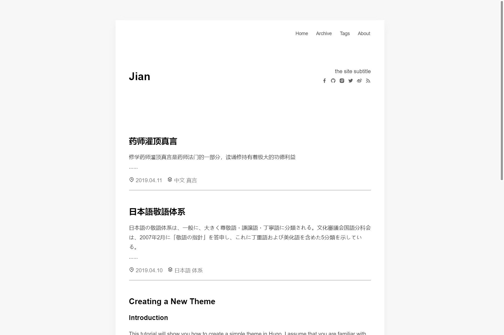

# Hugo Theme Jian

[](https://github.com/wdpm/hugo-theme-jian/blob/master/LICENSE)

Jian is a very simple but elegant Hugo theme for blog.

> It's a port of [zozo](https://github.com/varkai/hugo-theme-zozo)

## Features

- No JQuery & FancyBox
- No Animate.css
- Rewrite all css and html by BEM methdology
- Responsive
- Syntax highlighting with highlight.css
- Math support with MathJax
- Social links(Customize) with remixicon.css
- Tags/Archive/About page
- Disqus and [Valine](https://valine.js.org/en/index.html) comment-system
- GoogleAnalytics

## Screenshots



## Installation

```bash
$ git clone https://github.com/wdpm/hugo-theme-jian themes/jian
```
Take a look inside the exampleSite folder of this theme. You'll find a file called config.toml.  
To use it, copy the config.toml to the root folder of your Hugo site. Feel free to change it.

Now you can write post under the root folder in /content.

## ExampleSite

There is an example site with config file and markdown files in exampleSite directory.

### preview exampleSite
```bash
cd /path/to/dir/themes/jian/exampleSite
hugo server --themesDir ../..
```
Browse site on http://localhost:1313

## About Page

Use the about page to introduce yourself to your visitors.  
You can customize the content as you like in the `/content/about/index.md`.

## Hide Pages

Pages can be hidden and don't appear in the post list on the homepage if you add the variable `hidden = true` to the front matter.  
This allows you to link from elsewhere, i.e. just the menu.

## MathJax

This theme supports MathJax, which is turned on by default.  
If you want to use them, make sure `mathjax = true` under the `[params]` to support the MathJax.

## Valine Comment System

This theme provides valine comment system, turned off by default, if you want to use it, need to set in `config. toml`.
Set the `enable = true` under `[params.valine]` to open valine, and will be `appId` and `appKey` set for yourself.

## Social Link Icons

You can add a social link panel in the header by adding entries to the social block in the `config.toml`.

[Remix icon](https://remixicon.com/) is used in this theme.

## Nearly finished

In order to see your site in action, run Hugo's built-in local server.
```bash
$ hugo server
```
Now enter localhost:1313 in the address bar of your browser.

## License

MIT

## Acknowledgements

- [zozo](https://github.com/varkai/hugo-theme-zozo)
